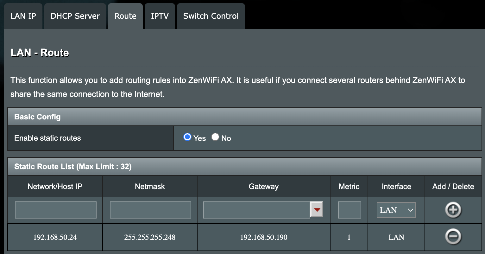

# metallb-config

# Step 1 - Install MetalLB Operator
Using OCP console

# Step 2 - Advertise Address Range

Define AddressPool (example with IPv4)
```
apiVersion: metallb.io/v1beta1
kind: IPAddressPool
metadata:
  name: ip-addresspool
  namespace: metallb-system
spec:
  addresses:
    - 192.168.50.24/29
  autoAssign: true
  avoidBuggyIPs: false
```
In this example, I am delegating a /29 to MetalLB.  From 192.168.50.25 to 192.168.30 
The configuration must be done in metallb-system namespace

create MetalLB components:

```
apiVersion: metallb.io/v1beta1
kind: MetalLB
metadata:
  name: metallb
  namespace: metallb-system
```

There can be only one MetalLB per OCP cluster and it must reside in the metallb-system namespace

Advertise addresses:

```
apiVersion: metallb.io/v1beta1
kind: L2Advertisement
metadata:
  name: l2
  namespace: metallb-system
spec:
  ipAddressPools:
    - ip-addresspool
```
In this example we are using Level 2 advertisement.  BGP is also possible.

# Step 3 - Configure Home Route
This is very specific to the router brand and capabilities. Here is an example for my Asus router:



Essentially, delegate the /29 subnet (with the equivalent netmask) to the IP of the OpenShift cluster and let OpenShift (metallb) handle these IPs

# Step 4 - example:

I have deployed a basic mysql using the OCP quickstart and replaced the service with a service of type LoadBalancer.  MetalLB does the rest

```
oc expose dc mysql --type=LoadBalancer
```
